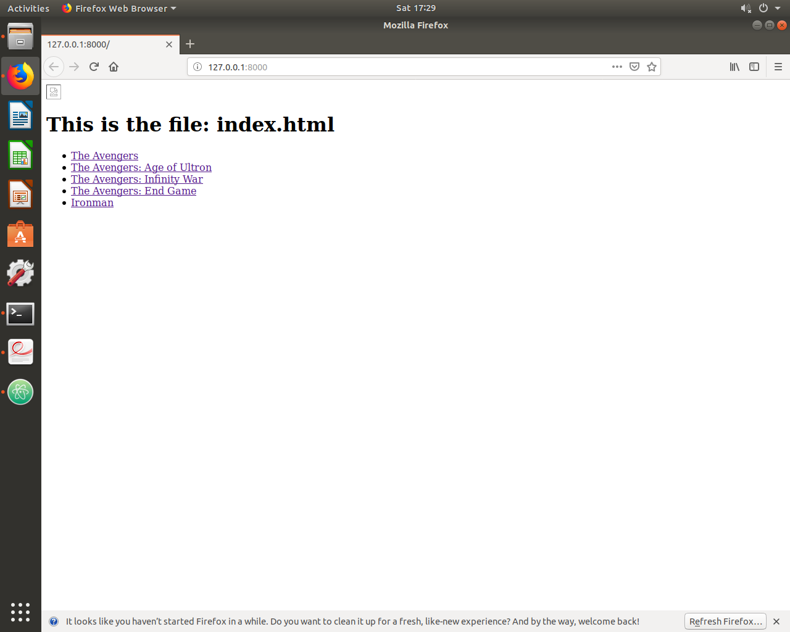
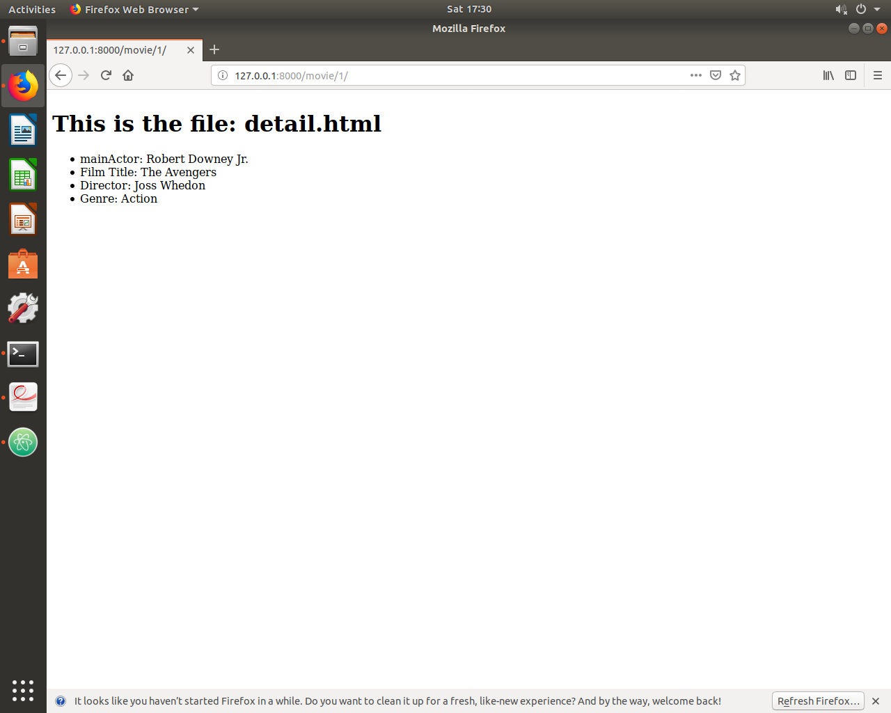
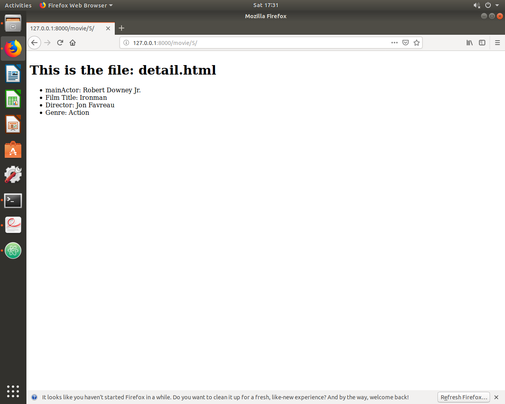

#### Date: 8 March 2019
#### Name(s): Matt Marconi and Steven Li

#### This is our report of of the project's success. We include screenshots.

The main difficulties we encountered during this lab was making sure we had all
of the correct files. There was numerous files that needed to be copied and
edited from the in-class examples. This process required a lot of time and attention
to detail. Although we were able to successfully complete the lab in the end.
