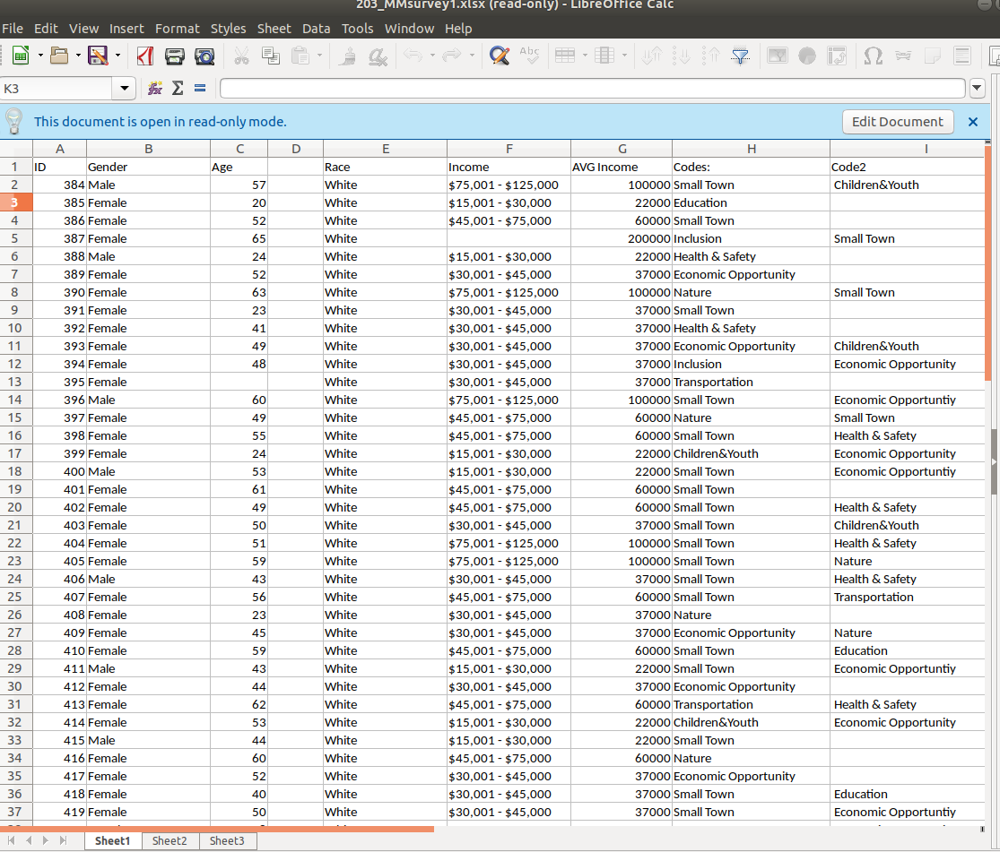

#### Date: 15 April 2019
#### Name(s) (please include all names of your group): Matt Marconi and Steve Bailong

#### Progress Report
(a) The subject of your project
Wage fairness and what variables impact it.
(b) The main questions are you that you are addressing,
What are the main variables that impact wages.
(c) The citations of your data and some leading references to support the project

(d) The steps that you have already taken
We have already collected our data.
(e) The step left to complete the project
We must still build our database.
(f) The names of the group members with their assigned tasks to the project
We will be doing all the work together.

###### Please add screen shots in your progress report as relevant. The code to add graphics is the following:

