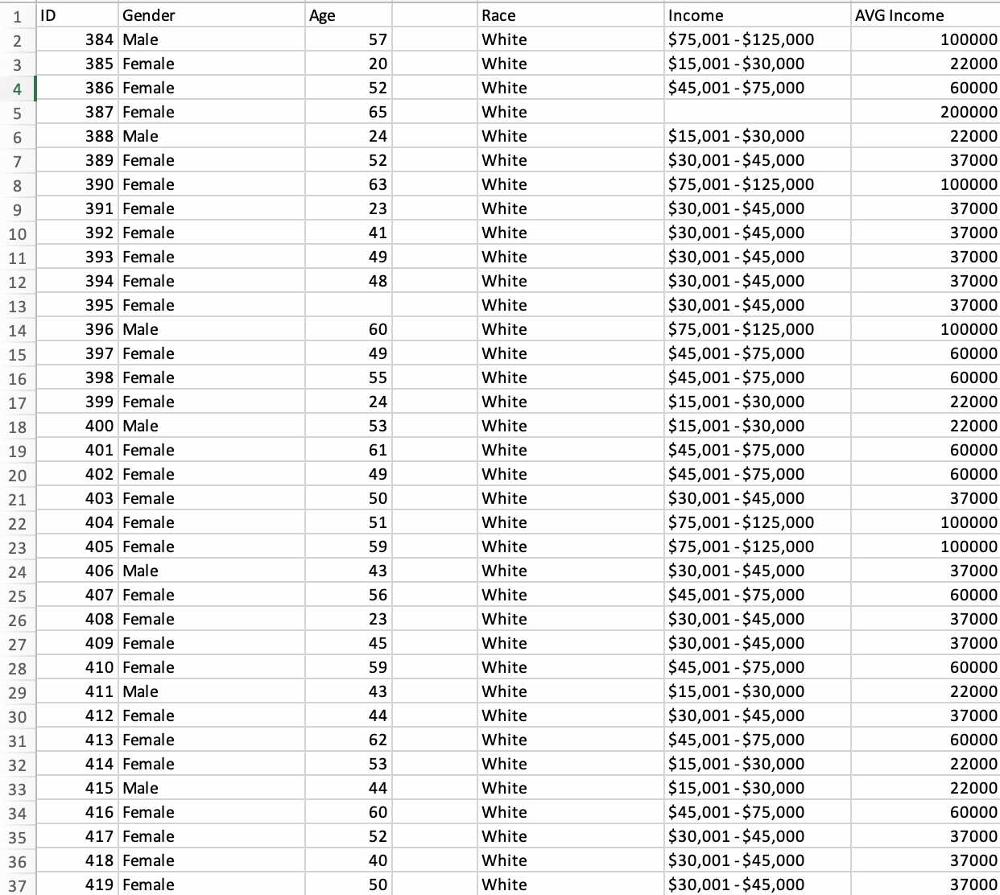
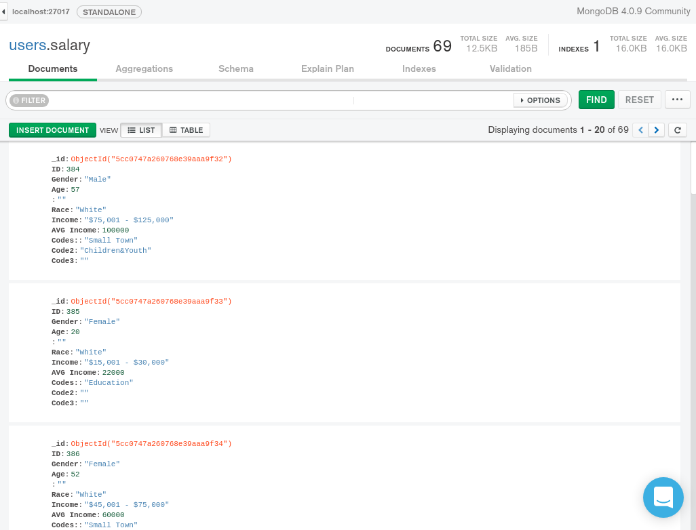
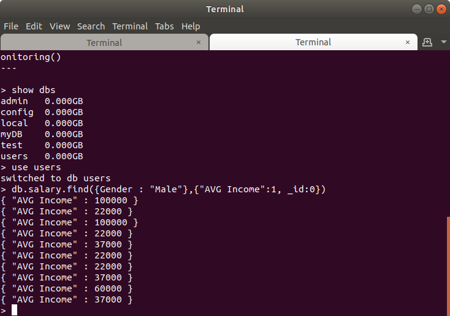
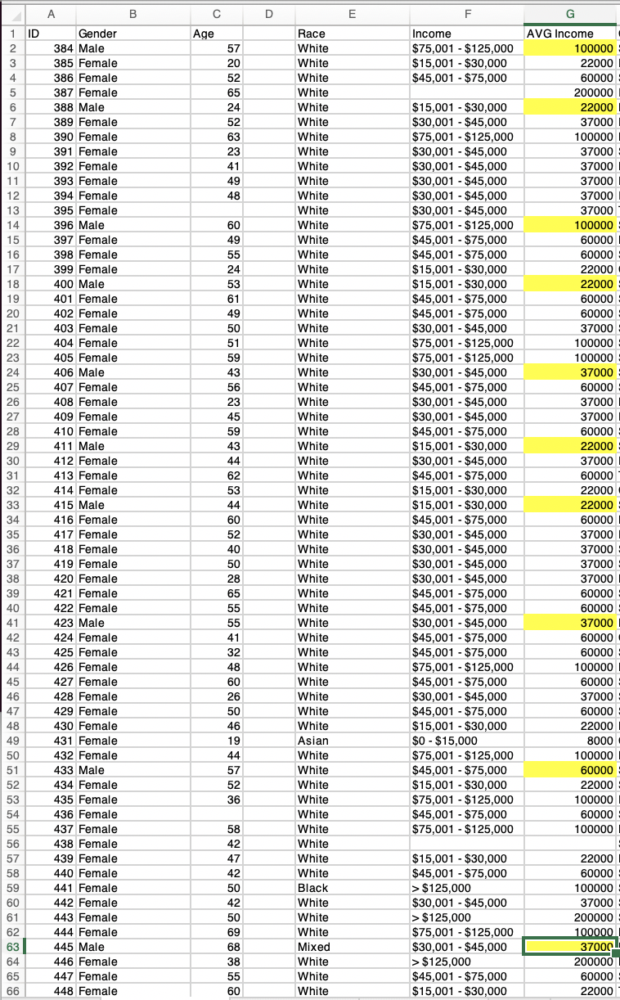
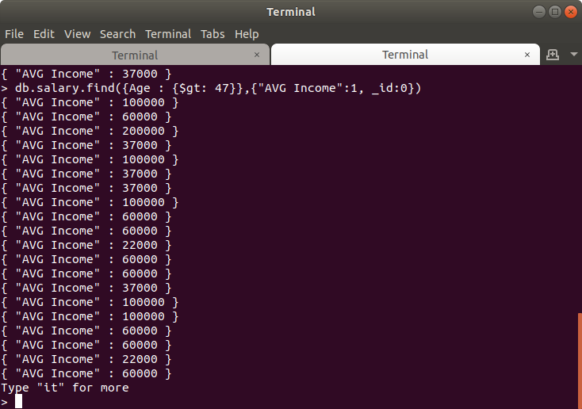
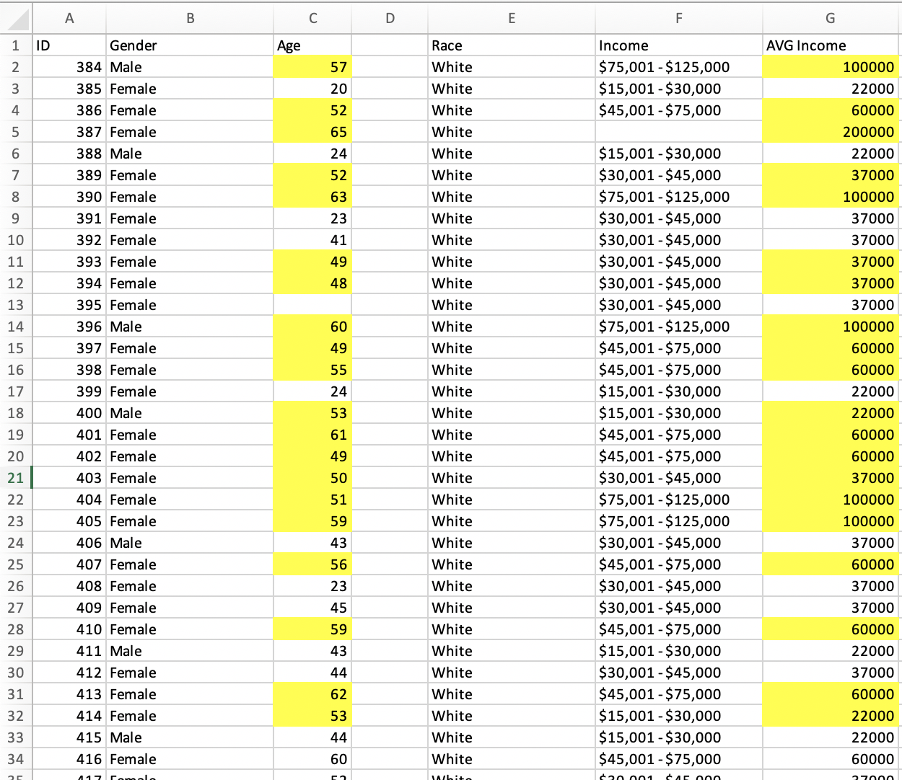
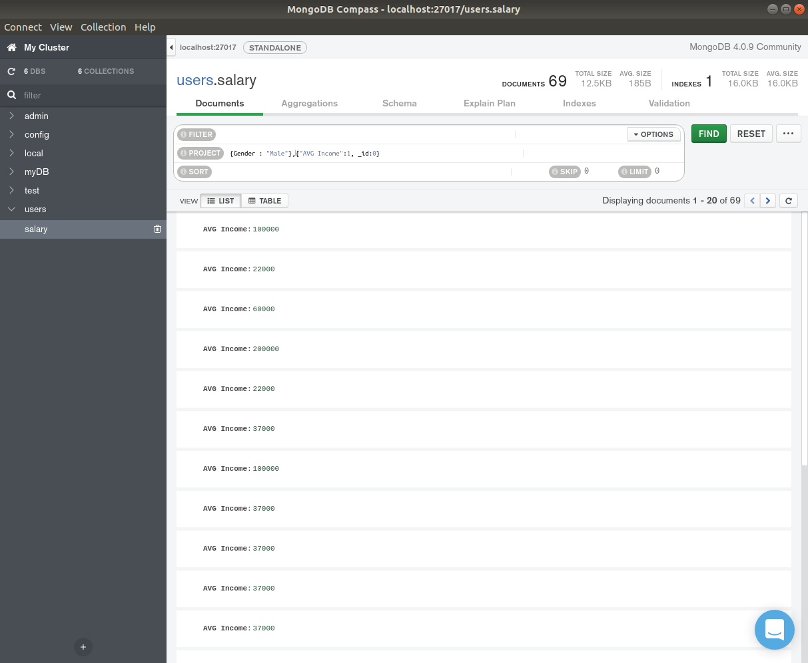

# Date: 6 May 2019
# Name(s): Matt Marconi and Steve Li

## Final Report

### Data

The data we chose to use pertained to what factors impact the wages of workers.
In doing this we collected the data from (insert reference here). Our data
includes information on sixty-nine different people. The data on each person
has five different factors. These factors are gender (male or female), age,
race (white, black, or asian), location (urban or rural), and post-secondary
education (college or no college). These different factors for the data also
make up the attributes for the queries.

The first attribute, gender, is only
made up of two different options, male or female. Of our sixty-nine subjects,
only ten are male, while the remaining fifty-nine are female. This was random
and out of our control as we downloaded our database.

The second attribute is age. The ages in our data range from twenty to
sixty-nine. This large range allows us to account for more fluctuation patterns
in wages pertaining to age. Although the average age of our subjects is about
forty-seven years old.

The third attribute is race. This attribute only has three different options,
white, black, and asian. Although our data does not have much variety in this
factor as there is only one asian subject as well as one black subject. The rest
are white. This does not make for great research on the topic of factors
impacting wages, although once again it was out of our control as this is what
we were given when downloading the data.

The fourth attribute is location. This attribute is similar to gender as it
only accounts for two different possibilities in our data. Luckily it is
somewhat evenly divided in our database between the people who reside in an
urban area versus a rural area.

The fifth attribute is post-secondary education. This is measured on a yes or
no basis. Once again this is divided fairly evenly among our subjects.

Along with each subject in the database is an accompanying salary. Our research
questions will pertain to seeing which attributes, or factors, impact these
wages the most.

  Below is a screenshot of a portion of the excel file which holds our data.

### Database software

In out final project we opted to use MongoDB for our database software.
After weighing our options between the different softwares we came to the
conclusion of utilizing MongoDB for a variety of reasons. Our first main reason
for making this decision was the fact that multiple people can work on the
database at the same time. This is a key factor with MongoDB, especially when
completing a group project. Another benefit we saw to this software is that it
is essentially schema free. We found this to be very nice as it saved us a lot
of time with source code. Next we found it extremely easy to import our data
from excel into the Mongo database. We were able to find a simple command
online that made the import effortless. The command was
`mongoimport --db users --type csv --headerline --file salary.csv`. A final
factor in this decision was the MongoDB Compass tool. This is an added tool
that is extremely user friendly, and allows another way of writing queries
for out database.

These factors outweighed the benefits to any other softwares in our opinion.
With the help of MongoDB we were able to successfully build our database and
complete out final project.

### Schema

As mentioned in the above section, one of the benefits of MongoDB is that
it is somewhat schema free. At least it does not require us to make a schema.
Although by utilizing the MongoDB Compass tool you can still view what is
similar to a schema. Something that still displays the different attributes of
the database.

Below is a screenshot from the MongoDB Compass tool. It displays what would
be similar to a schema in other softwares.

### Source Code

A benefit to utilizing the MongoDB software is that it did not require any
source code to design a schema or insert any attributes into the database.
The source code for creating our database was actually quite simple. There
were only a few steps that it took in creation. First we ran
`mkdir ~/mongodbData` in the terminal window to setup a data directory. Next
we ran `mongod --dbpath ~/mongodbData/` in the terminal to start the Mongo
server with data directory as a parameter. We then opened up a new terminal
and ran `mongo` to start the client. Then we followed with a `show dbs`
command to get a list of the different databases in our mongo server. Since
the database we were using for this project was called "users," we ran the
command `use users` to select it. Finally came the command to populate our
data base with the csv file. The command for that was
`mongoimport --db users --type csv --headerline --file salary.csv`. These
few commands made for a stress free process of creating and populating the
database for our final project.

### Queries

We design 5 queries for 5 research questions and all the queries can give us enough data for the specific research question. Since both of I and Mat were in the data analytics class, we well designed these questions and queries for data analytics and futer research question. The first query is db.salary.find({Gender : "Male"},{"AVG Income":1, _id:0}). The second query is db.salary.find({Gender : "Female"},{"AVG Income":1, _id:0}). The third query is db.salary.find({Age : {$gt: 47}},{"AVG Income":1, _id:0}). The fourth query is db.salary.find({Age : {$lt: 47}},{"AVG Income":1, _id:0}). The fifth query is db.salary.find({Code : "Small Town"},{"AVG Income":1, _id:0})

### Interpretation of Information from the Queries

After we have a general look of our data, we have a question what can affect wages and how? In order to solve that question, we designed five research questions to create five different databases. The first query shows the income of male in the database. The seconde query shows the income of female in the database. The third query shows the income of people who is older than 47 years old(47 is the average age in this data). The fourth query shows the income of people who is younger than 47 years old. The fifth query shows the income that people who is living in the Small Town. By running or query, we can get the income data from different gender, age and location(Urban or not). After that, we can use R studio to run the Regression with these databases to answer our long term question : What can affect wages and how? 

### Testing Your Database

When exploring the best way to test our database and prove its accuracy,
we felt the most effective approach would be proving it with screenshots. In
our first screenshot we run a simple query which returns the income of all of
the males in our data set. The terminal command is
`db.salary.find({Gender : "Male"},{"AVG Income":1, _id:0})`

The screenshot below is a portion of our data set in an Excel document. I
have highlighted all of the average income values of males in the data to show
that it matches the returned values from the earlier terminal command.

A second example I chose to use is the terminal command
`db.salary.find({Age : {$gt: 47}},{"AVG Income":1, _id:0})`. This command
returns the average income for all people in the database who are over the age
of 47, the average age of the subjects in our data set. You can see what the
query returns in the below screenshot.

Once again we highlighted the corresponding data in our excel document to
prove the accuracy of our database. This can be seen in the below screenshot
which highlights all of the people are of 47 years and older, as well as their
corresponding average income.

### Interface

We choose mango as our database for this project because mango not only can support multiple people work on the same time but also has a better interface than SQL. Mango database not only can use shell to run query but also support compass to run querys. Compass has a better interface for us to look at the schema, query and data.

### References

I got this data from by ECON 203 applied statistics class and this data is from allegheny library database.

###### Please add screen shots in your report. The code to add graphics is the following:

(edit as necessary)
